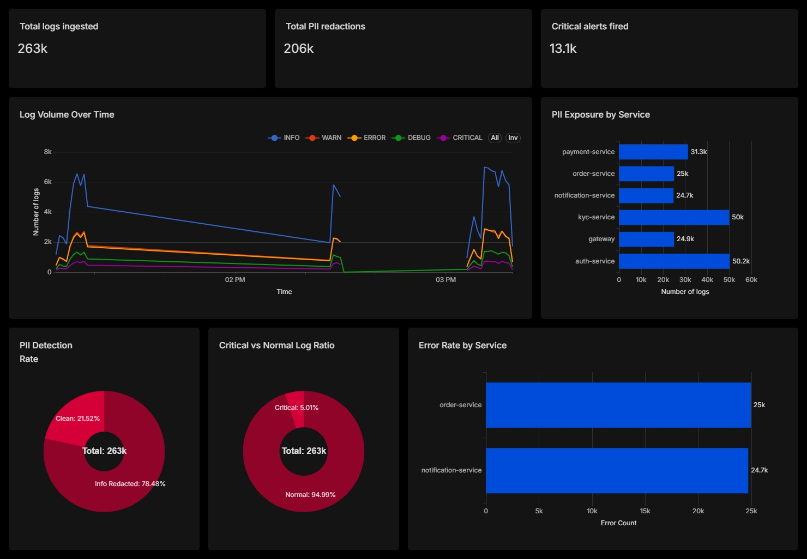

# 🛡️ Log-Guard

Modern systems generate massive volumes of logs; but handling them securely and reliably is non-trivial.  
This project delivers a **production-grade, event-driven log processing pipeline** that redacts sensitive data, detects critical failures, and guarantees fault-tolerant processing. 🔐⚡


---

## 💡 Why this project matters

- Most logging pipelines are an afterthought - logs get written raw to a file or database with no sanitisation, no fault tolerance, and no alerting.  
- In regulated industries (fintech, healthcare, e-commerce), this is a compliance and security liability.  
- A single log line containing a credit card number or Aadhaar ID written in plaintext can constitute a data breach. 🚨

Log-Guard treats the log pipeline as a first-class production concern:

- **Personally Identifiable Information** never reaches the database. Redaction happens in-memory before any persistence, using mathematically validated patterns (Luhn for credit cards, Verhoeff for Aadhaar) to avoid false positives.
- Failures are never silently dropped. Every message that cannot be processed is NACK'd with `requeue=false` and routed to a **Dead Letter Queue for inspection and replay**, not lost.
- **CRITICAL events** get human attention fast. The **alerting path is fully async and decoupled from the processing pipeline** - a slow or unavailable webhook cannot stall message consumption.
- The system is **observable out of the box**. Spring Boot Actuator exposes health, metrics, and a Prometheus scrape endpoint with zero configuration.

---

## Features ⚙️

- **REST ingestion** with `jakarta.validation` - malformed requests are rejected at the HTTP layer with detailed errors before they touch the queue 🧾  
- **PII redaction** - six pattern categories with Luhn (credit card) and Verhoeff (Aadhaar) checksum validation to eliminate false positives 🔐  
- **Event-driven processing** via RabbitMQ - ingestion is decoupled from processing; the REST endpoint returns `202 Accepted` immediately 🔄  
- **Dead Letter Queue** - failed messages route automatically to it for future inspection
- **CRITICAL alerting** via `WebClient` - fires `@Async` before the DB write so a slow Postgres cannot delay a human notification 🚨  
- **Exponential backoff retry** on the alert path - `@Retryable` with 1s -> 2s -> 4s delays and ±jitter; `@Recover` logs exhaustion for fallback handling 🔁
- **Dual-write data lake** - redacted logs exported to `AWS S3` as GZIP Parquet
  with Hive partitioning (year/month/day/service); `Athena` partition registration
  automated via MSCK REPAIR TABLE; `Apache Superset dashboards` for analytics 🗄️
- **Spring Boot Actuator** - `/health`, `/metrics`, `/prometheus`, `/loggers` exposed out of the box 📊  
- **Fully containerised** - Docker Compose brings up the app, RabbitMQ (with management UI), and PostgreSQL in a single command 🐳


---

## Architecture


---

## Performance

Load tested with [k6](https://k6.io) against a local single-node deployment (all three containers on one machine).

| Metric | Result |
|---|---|
| Sustained throughput | 510 req/sec |
| p(90) latency | 99ms |
| p(95) latency | 138ms |
| p(99) latency | 246ms |
| Concurrent users | 50 |
| Messages processed | 137,966 |
| Message loss | 0 |
| DLQ failures | 0 |
| HTTP failures | 0 |

Every message published made it through the full pipeline end-to-end (REST -> RabbitMQ -> PII redaction -> PostgreSQL) with zero loss.

---

## Dashboards

Redacted logs are exported to AWS S3 as compressed Parquet files and queried through AWS Athena.  
Apache Superset provides real-time observability into pipeline throughput, PII exposure, and system health.

### Key Metrics

| Metric | Description |
|----------|-------------|
| Total Logs Ingested | Total number of logs processed by the pipeline |
| Total PII Redactions | Count of sensitive fields successfully detected and masked |
| Critical Alerts Fired | Number of CRITICAL severity events generated |

### Visualisations

| Dashboard | Description |
|------------|-------------|
| Log Volume Over Time | Real-time log throughput grouped by severity level (INFO, WARN, ERROR, DEBUG, CRITICAL) |
| PII Exposure by Service | Services generating the highest volume of sensitive data requiring redaction |
| Error Rate by Service | ERROR log counts aggregated by microservice |
| PII Detection Rate | Percentage of logs containing redacted sensitive information versus clean logs |
| Critical vs Normal Log Ratio | Distribution of CRITICAL events relative to overall traffic |

The dashboard enables rapid identification of noisy services, abnormal error spikes, and potential PII leakage hotspots while providing end-to-end visibility into the redaction pipeline.



---

## Design Decisions

**Why manual ACK instead of auto-ACK?**  
Auto-ACK removes the message from the queue as soon as it's delivered to the consumer. If the JVM crashes mid-processing, the message is lost permanently.  
Manual ACK means the broker holds the message until the consumer explicitly confirms success - guaranteeing at-least-once delivery, which is crucial for prevention of PII leak.

**Why `saveAndFlush` instead of `save`?**  
save batches SQL and flushes only at transaction commit time.  
When combined with @Transactional:

- PostgreSQL constraint violations occur after the try/catch block exits
- basicNack never fires
- Messages get requeued indefinitely

saveAndFlush fixes this by:

- Forcing the INSERT inside the try block
- Throwing DB exceptions immediately
- Allowing proper NACK -> DLQ routing

I have intentionally avoided @Transactional for this reason.

**Why alert before persist?**  
A CRITICAL log means something is actively on fire.  
The alert is triggered using @Async before saveAndFlush so:

- A slow or momentarily unavailable PostgreSQL doesn't delay alerts.
- Alerting and persistence remain fully independent.

**Why Luhn and Verhoeff validation on top of regex?**  
Credit card and Aadhaar patterns overlap significantly with other numeric identifiers - order IDs, invoice numbers, transaction references.  
Pure regex would produce false positives and silently corrupt legitimate log data.  
Luhn validation ensures only mathematically valid card numbers are redacted; Verhoeff does the same for Aadhaar. Any number that fails the checksum is left untouched.

**Why `x-message-ttl` and `x-max-length` on the queue?**  
These provide data freshness + back-pressure control:

- TTL (30 min): Prevents stale logs from being processed too late
- Max length (500k): Caps queue growth if consumers fall behind. Prevents unbounded memory usage in RabbitMQ

---

## Quick Start

### Prerequisites
- Docker Desktop (running)
- Git

```bash
git clone https://github.com/superb-striker/log-guard.git
cd log-guard

# Get a free webhook URL for testing CRITICAL alerts
# Visit https://webhook.site and copy your unique URL
export WEBHOOK_URL=https://webhook.site/your-uuid-here
```

### Start the stack

```bash
docker-compose up --build
```

Wait for all three services to report healthy - the app takes ~15s after RabbitMQ is ready. You should see:

```cmd
log-guard-app | Tomcat started on port 8080
log-guard-app | Attempting to connect to: [rabbitmq:5672]
log-guard-rabbitmq | accepting AMQP connection
```

Services:

| Service | URL | Credentials |
|---|---|---|
| Log-Guard API | http://localhost:8080 | - |
| Actuator | http://localhost:8080/actuator | - |
| RabbitMQ UI | http://localhost:15672 | admin / admin |
| PostgreSQL | http://localhost:5432 | guard / guard_secret |

### Verify the stack is healthy

```bash
curl http://localhost:8080/actuator/health | jq
```

Both `rabbit` and `db` should show `UP`. If either shows `DOWN`, check `docker ps` - a container may still be starting.

---

## Testing

### 1. Send a normal log (INFO)

```bash
curl -X POST http://localhost:8080/api/logs \
  -H "Content-Type: application/json" \
  -d '{
    "service": "payment-service",
    "level": "INFO",
    "message": "Transaction for user john@example.com from 192.168.1.100",
    "traceId": "abc-123",
    "metadata": { "region": "us-east-1", "env": "prod" }
  }'
```

Expected: `202 Accepted`

### 2. Send a CRITICAL log (triggers webhook)

```bash
curl -X POST http://localhost:8080/api/logs \
  -H "Content-Type: application/json" \
  -d '{
    "service": "auth-service",
    "level": "CRITICAL",
    "message": "DB pool exhausted. Card 4532015112830366 exposed. Contact admin@corp.com",
    "traceId": "xyz-999"
  }'
```

Check your webhook.site URL - you should see an incoming POST within seconds.

### 3. Verify PII was redacted

```bash
docker exec -it log-guard-postgres \
  psql -U guard -d log-guard \
  -c "SELECT service, level, message FROM log_entries ORDER BY ingested_at DESC LIMIT 5;"
```

The `message` column should show `[CC REDACTED]` and `[EMAIL REDACTED]` - never the raw values.

### 4. Test validation rejection

```bash
curl -X POST http://localhost:8080/api/logs \
  -H "Content-Type: application/json" \
  -d '{"service": "svc", "level": "INVALID", "message": "test"}'
```

Expected: `400 Bad Request` with body listing `fieldErrors`.

### 5. Force a message into the Dead Letter Queue

Open the RabbitMQ Management UI at http://localhost:15672, log in with `admin / admin`, then:

1. Go to **Queues and Streams** -> click `guard.logs.queue`
2. Scroll to **Publish message**
3. Set delivery mode to **Persistent** and paste this payload:

```json
  {"service": null, "level": "INFO", "message": "test"}
```

4. Click **Publish message**

The worker will fail to deserialise it, catch the exception, call `basicNack(requeue=false)`, and the message routes to `guard.logs.dlq`. Check **Queues -> guard.logs.dlq** - you should see 1 message ready. Click **Get messages** to inspect it - RabbitMQ adds `x-death` headers showing the source queue, reason (`rejected`), and timestamp.

### 6. Check stats

```bash
curl http://localhost:8080/api/logs/stats | jq
```

### 7. Run the load test

```bash
k6 run loadTest.js
```

Watch Spring logs for batch flushes, S3 uploads, and Athena partition repairs firing in real time.

---

## Redaction Reference

Redaction happens in `PersonallyIdentifiableInfoRedactionService` before any persistence. Patterns are applied in this order (order matters - tokens are redacted before emails to prevent partial matches inside JWT payloads):

| Category | Detection | Validation | Output |
|---|---|---|---|
| Bearer / JWT token | `Bearer ...` prefix or `eyJ` header | None (structural) | `[TOKEN REDACTED]` |
| Email | RFC 5322 approximation | None | `[EMAIL REDACTED]` |
| IPv4 | Strict octet range (0–255) | None | `[IP REDACTED]` |
| Indian phone | 6–9 prefix, 10 digits, any grouping | None | `[PHONE REDACTED]` |
| Credit card | Visa · Mastercard · Amex · RuPay prefixes | **Luhn checksum** | `[CC REDACTED]` |
| Aadhaar | 12 digits, starts 2–9 (not 5) | **Verhoeff checksum** | `[AADHAAR REDACTED]` |

Checksum validation means a 16-digit order ID that happens to start with `4` will not be redacted as a Visa card - it must actually pass Luhn to be touched.

---

## API Reference

### `POST /api/logs`
Ingest a single log entry. Processing is async - returns immediately.

```json
{
  "service":   "string (required, max 100)",
  "level":     "DEBUG|INFO|WARN|ERROR|CRITICAL (required)",
  "message":   "string (required, max 5000)",
  "timestamp": "ISO-8601 instant (optional, defaults to now)",
  "traceId":   "string (optional, max 64)",
  "spanId":    "string (optional, max 64)",
  "metadata":  { "key": "value" }
}
```

Response: `202 Accepted`

### `POST /api/logs/batch`

Ingest a JSON array of log entries. Each is validated and published individually.

### `GET /api/logs`

Paginated retrieval. Supports `?page=0&size=20&sort=timestamp,desc`.

### `GET /api/logs/level/{level}`

Filter by log level. Example: `/api/logs/level/CRITICAL`

### `GET /api/logs/stats`

Aggregate counts by level.

```json
{
  "total": 42,
  "debug": 10,
  "info": 20,
  "warn": 5,
  "error": 4,
  "critical": 3
}
```

### `GET /actuator/health`

Full health check including DB and RabbitMQ connection status.

---

## Local Development

```bash
# Start app
docker-compose up --build
```

The app auto-creates the `log_entries` table on first boot via `ddl-auto: update`. To reset the schema, stop the app and run:

```bash
docker-compose down -v
docker-compose up --build
```

---
